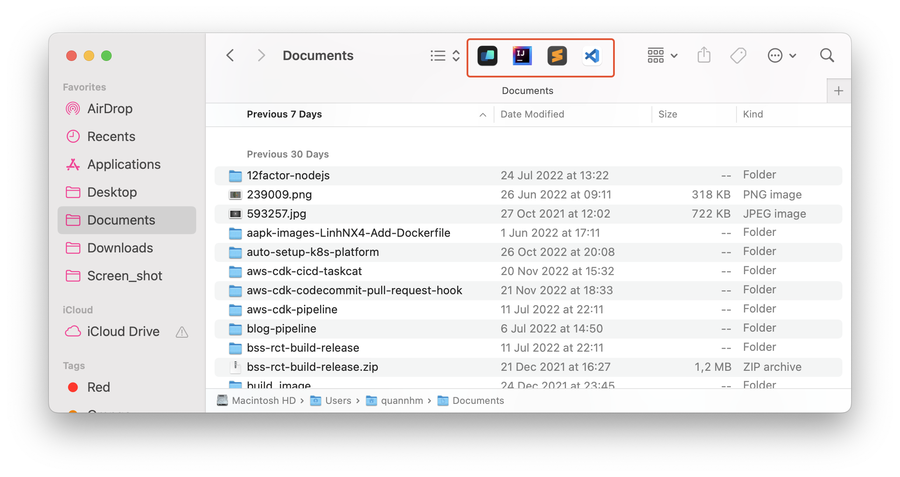
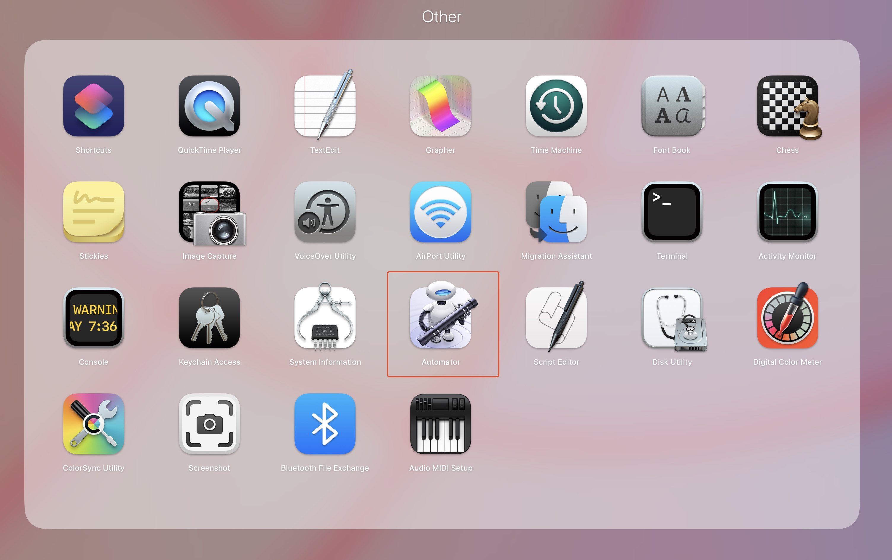
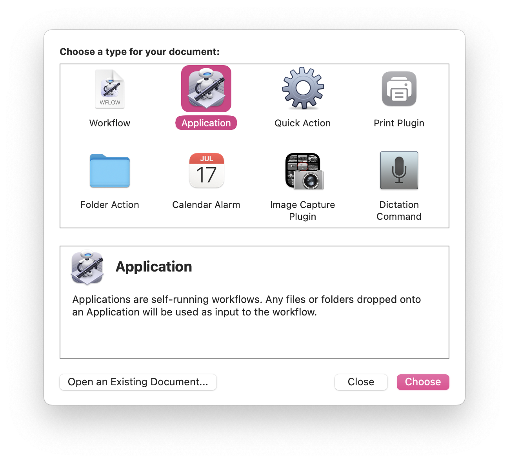
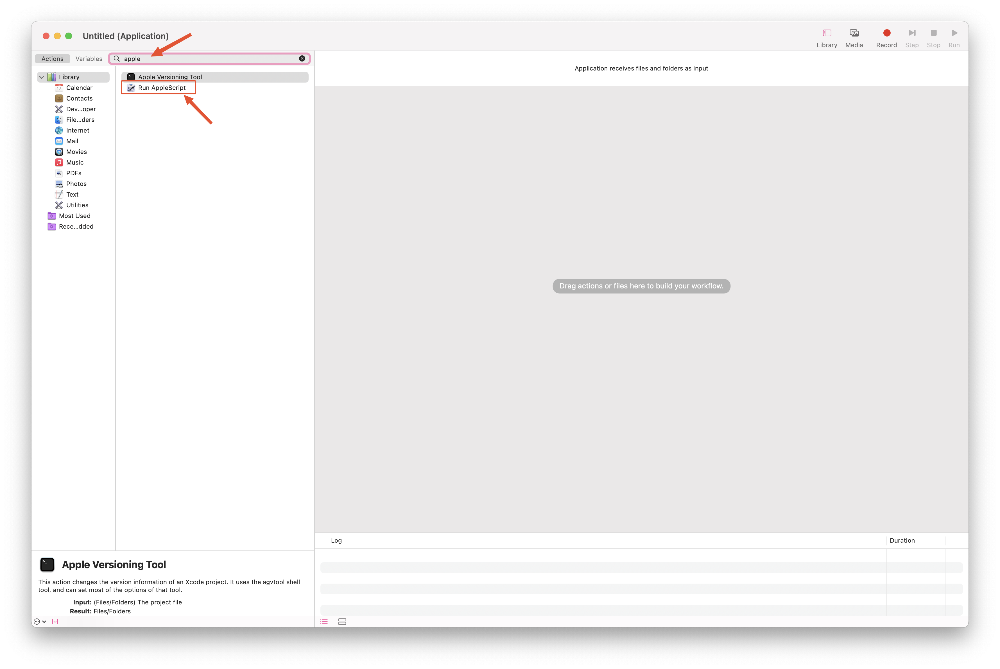
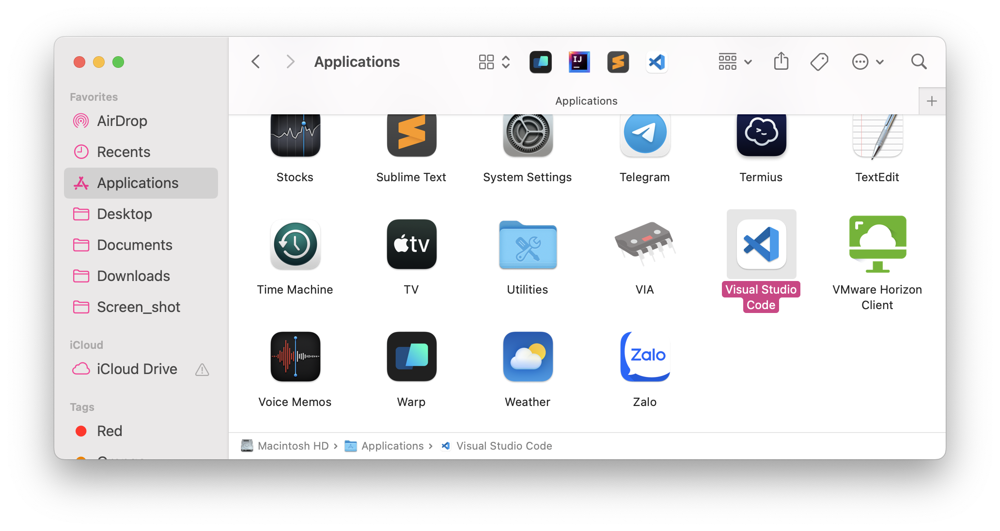
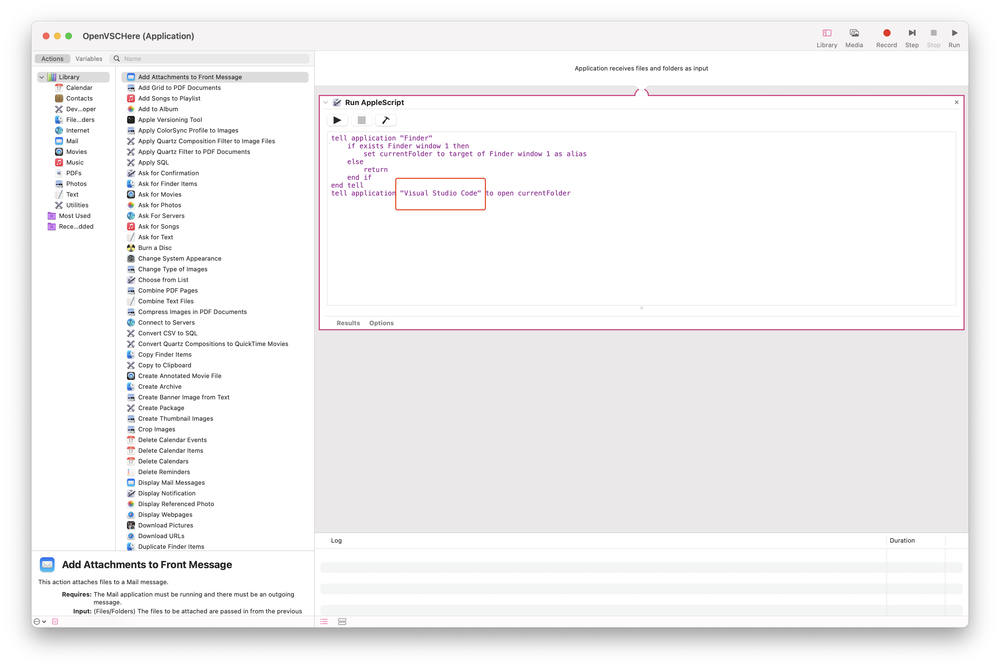
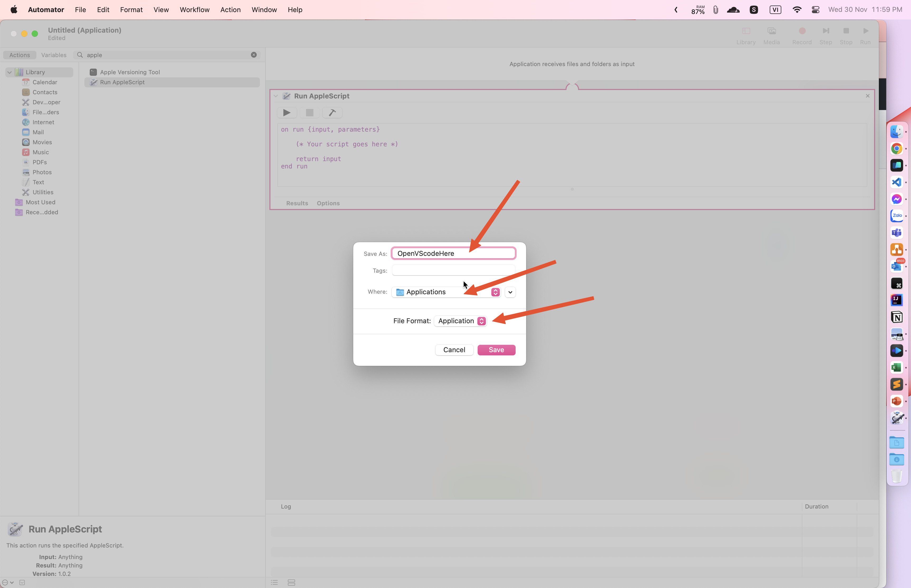
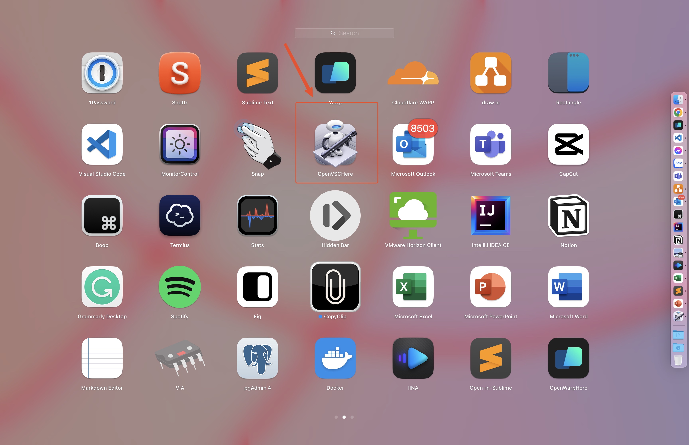
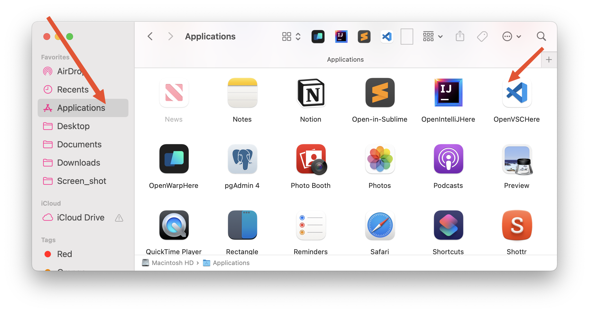

# Cấu hình shortcut trên finder

trong hướng dẫn này mình sẻ cấu hình ứng dụng mình hay sử dụng là VScode, các ưng dụng khác cũng làm tương tự.
# Automator
Để làm được điều này, mình sẻ dùng ứng dụng Automator, mặc định có sẳn trên macOS, các bạn có thể dùng Spotlight để tìm.


# Bắt đầu
## khởi chạy ứng dụng Automator
sau khi khởi chạy ứng dụng, màn hình sẻ trông như sau.  

chọn vào application.   
## cấu hình apple script
tại thanh tìm kiếm, bạn tìm với từ khoá "apple"   

sau đó chọn vào "Run AppleScript"  
## chèn script 
mình có đoạn script như sau, các bạn copy và sửa lại tên ứng dụng muốn chạy là được, ở đây mình dùng VScode, lưu ý để tìm được tên ứng dụng bạn cần truy cập vào Application để xem được tên đầy đủ của ứng dụng.

```ruby
tell application "Finder"
    if exists Finder window 1 then
        set currentFolder to target of Finder window 1 as alias
    else
        return
    end if
end tell
tell application "Visual Studio Code" to open currentFolder
```
thay tên ứng dụng tại đây  

## lưu dưới dạng là một ứng dụng
khi lưu dưới dạng là một ứng dụng, mình mới có thể ghim nó vào thanh tools bar của finder.

lưu ý ở ba phần mình đánh dấu, bạn phải đặt tên cho ứng dụng, tránh đặt trùng tên, hoặc tên tiếng việt, nên viết ko dấu liền nhau.  
sau khi lưu xong sẻ có một ứng dụng trên app draw  


## ghim vào thanh tools bar của finder

bạn truy cập vào thư mục application trong finder, nhấn giữ phím command và kéo thả ứng dụng vào vị trí mong muốn trên tools bar.   

# đổi icon của automator app cho đẹp
mặc định app của Automator có icon không dễ nhận biết, để đổi icon các bạn làm theo link sau nhé
https://apple.stackexchange.com/questions/369/can-i-change-the-application-icon-of-an-automator-script/372#372